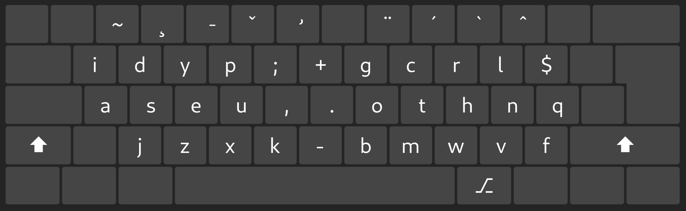
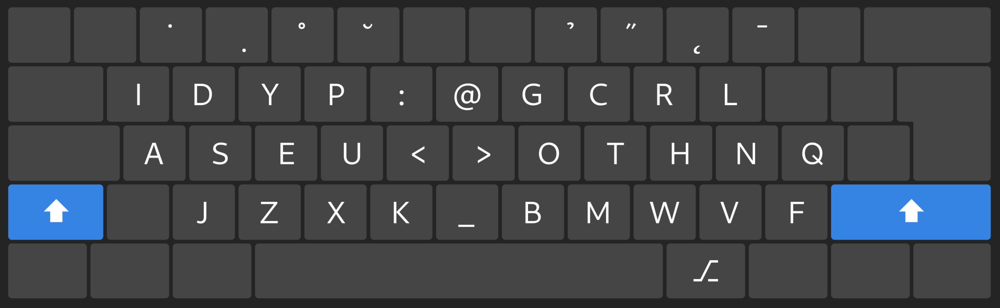
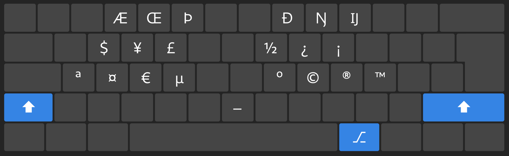
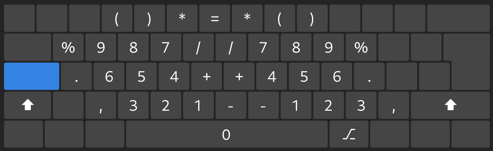
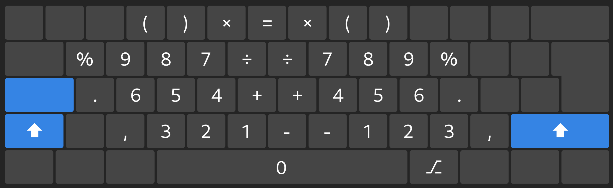
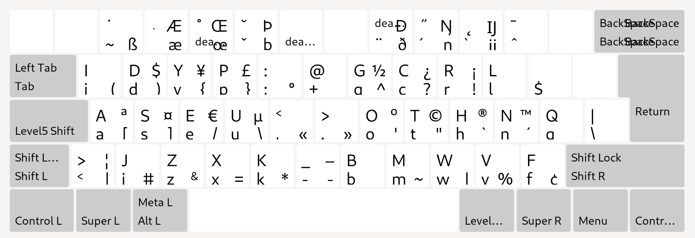
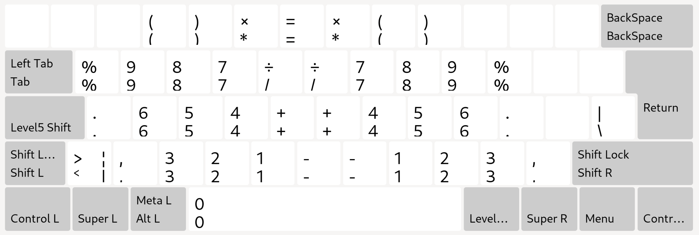

# The Dwev Keyboard Layout
## Yet another ergonomic keyboard layout
Dwev is a keyboard layout that aims to minimize fingers moves, with a focus on limiting lateral moves, as opposed to vertical moves.

It is compact, and mostly uses only the three main rows of the keyboard, avoiding having to stretch your hands to reach the top row.

[[_TOC_]]

### Why?
As most people spending my days typing for a living, I started to look into alternative keyboard layout after suffering from RSI pains.
My first attempt was [bepo](https://bepo.fr/wiki/Accueil), the French variant of [dvorak](http://en.wikipedia.org/wiki/Dvorak_Simplified_Keyboard).

However, I quickly realized that apart from the odd email, 99% of my writing was English/coding, and it wasn't fit for purpose.

I then switched to standard [dvorak](http://en.wikipedia.org/wiki/Dvorak_Simplified_Keyboard) and soon after to [programmer dvorak](https://www.kaufmann.no/roland/dvorak/).
While it was a huge progress over qwerty, I still had a few nagging issues, which I solved by forking into a variant I dubbed [developer dvorak](https://github.com/pm98zz-c/dvorak-dev).

While it served me well for years, I still wasn't feeling 100% comfortable. But I could't quite put the finger on what were the painpoints. Until one day I stumbled upon the [workman](https://workmanlayout.org/) layout.
That was an eye opener and lead me to analyse more my typing movements. That nagging feeling I had been having was due to 
- lateral movements, namely the center column keys stretching the indexes
- too much effort and stretching put on the right pinky finger

I briefly tried the [workman](https://workmanlayout.org/) layout, but almost immediatly realized it didn't went far enough to my taste in addressing those issues. And here began the journey into trying to create an alternative, and explore some concepts I wasn't familiar with, like frequency of digrams, hand .
### Overview and key features
The Dwev layout is primarily aimed at writing in English and programming languages, although you can still write in most Western European languages using dead keys for diacritics and other symbols, which have been moved up the top row.

All letters are concentrated on the "home" keys, with a precedence given on easyness of typing common sequences instead of focusing only on single letters frequency for the home row[^1].

The middle columns thus only contains punctuation signs. This ensure that while we can't eliminate enterly lateral movements into these columns, it only happens in between words, not within.

The most right keys on the home and top rows(dash `#` and square brackets `[]` on qwerty) are left unused, as they require quite a stretch from the pinky finger[^2].

The result is we're able to type full words without ever leaving the home keys. This fits well with the way we visualizy full words and not sequences of letters, and the lateral movements feel more natural because they only occur for punctuation.

[^1]: The letter Q requires a slight movement to right from the pinky finger. There are only as many "home" keys, and something had got to give. I initially had placed the "J" there, as it is far less used than the "Q". However, it was placing the "Q" next to "Z", and operated by the left pinky finger.This made pressing "Ctrl+Q" an easy mistake to make when trying to "Ctrl+Z", so the small compromise between comfort and practicality is worth it, in my opinion.

[^2]: You'll notice there's actually an extra dollar `$` right to the "L". While it is accessible through modifiers already, and not strictly needed, I added a direct key due to its prevalence in some programming languages.

### Screenshots
**Level 1**

**Level 2**

**Level 3**

**Level 4**

**Level 5**

**Level 6**

**Overview**

Print those for training/learning.

